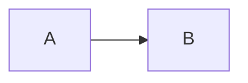

# Build-Time Mermaid Rendering

## Overview

The engine turns exact-language `mermaid` Markdown fences into static, content-addressed SVG images during
`blog-engine process`. Source Markdown remains unchanged, and the browser receives an ordinary image rather than
Mermaid, Puppeteer, raw diagram definitions, or executable diagram behavior.

## Purpose

Build-time rendering gives posts, dialogue content, and static pages one authoring contract while keeping the
reader bundle small and the output governed by a fixed security and accessibility policy. Invalid diagrams fail
the build before previously generated content or assets are replaced.

## Key Files And Structure

- `bin/process-content.js`: coordinates in-memory parsing, rendering, discovery output, and the final transaction.
- `bin/content/readContent.js`: reads frontmatter and calculates reading time from original Markdown.
- `bin/content/generatedModules.js`: serializes posts, pages, and navigation metadata.
- `bin/content/ContentBuildTransaction.js`: promotes staged assets and modules with rollback backups.
- `bin/mermaid/MermaidBuildSession.js`: owns the lazy browser, deduplication, rendering queue, and diagnostics.
- `bin/mermaid/MermaidRenderer.js`: calls the CLI renderer and enforces SVG output safety.
- `bin/mermaid/MermaidRequestPolicy.js`: denies renderer network and file requests outside CLI-owned resources.
- `bin/mermaid/markdown.js`: finds exact Mermaid fences and replaces them without disturbing surrounding Markdown.
- `bin/mermaid/renderPolicy.js`: defines fixed renderer settings, hashes, deterministic IDs, and base-path URLs.
- `bin/mermaid/svgDimensions.js`: derives stable intrinsic dimensions from the renderer's numeric viewBox.
- `bin/mermaid/svgSafety.js`: removes inactive anchor wrappers and rejects active or externally loaded SVG content.
- `src/vite/mermaidAssetsPlugin.js`: serves and copies only lowercase SHA-256 SVG filenames.
- `src/components/blog/MarkdownImage.jsx`: marks generated Mermaid images for responsive styling.
- `src/components/blog/markdownConfig.js`: shares Markdown behavior across posts, dialogue segments, and pages.

## Core Concepts

Only fenced blocks whose trimmed info string is exactly `mermaid` are rendered. The asset name is a SHA-256 digest
of Mermaid CLI `11.16.0`, the canonical render policy, and the diagram definition. The definition hash also seeds
Mermaid's deterministic IDs. Identical definitions share one render and one asset.

The render policy uses Mermaid's default theme, strict security, text-only SVG labels, a transparent background,
and secure deterministic settings. The session calls the public `renderMermaid` API from the exact-pinned Mermaid
CLI. It starts one Puppeteer browser only after finding a diagram and permits at most two concurrent renderer pages.
Each page permits only the CLI's exact bootstrap file, passive browser URLs, and the CLI's internal interception
origin. Other file, HTTP, HTTPS, FTP, and malformed requests are aborted before diagram rendering.

Image alternative text prefers `accDescr`, then `accTitle`, then `<article title> — diagram N`. Invalid diagrams
report the repository-relative Markdown path, diagram ordinal, opening-fence line, and Mermaid's parse detail.
Generated SVGs retain their viewBox and receive matching intrinsic dimensions so wide diagrams can scroll without
being squeezed until their labels become unreadable.

## How It Works

1. Load the resolved blog configuration, then parse every post and page in memory.
2. Calculate post reading time from the untouched Markdown.
3. Render unique definitions under `.geek-blog/mermaid-next-<pid>/` and replace fences only in generated content.
4. Close Chromium and generate robots and optional sitemap content in memory.
5. Stage the generated content and discovery modules under `.geek-blog/content-next-<pid>/`.
6. Back up live modules and `.geek-blog/mermaid`, then promote every staged output.
7. Restore all backups if promotion fails; remove the backups after a successful commit.

A successful build without diagrams creates an empty staged asset directory and replaces the live directory, which
removes obsolete SVGs without launching Chromium. A failed render removes only staging data.

## Important Patterns And Pitfalls

- Keep the Mermaid CLI and Puppeteer pins exact; renderer output is part of the asset identity.
- Bump `SVG_OUTPUT_POLICY` whenever SVG sanitization, normalization, or other byte-level post-processing changes so
  browsers and CDNs never reuse an asset URL for different SVG bytes.
- Do not pass `--no-sandbox`. The runtime must provide Chromium libraries and run as a non-root user.
- On Ubuntu 24.04 GitHub runners, hydrate dependencies before rendering, install Puppeteer's `chrome_sandbox` as a
  root-owned `4755` helper, and export its path through `CHROME_DEVEL_SANDBOX`. This keeps the pinned browser
  sandboxed when AppArmor blocks unprivileged user namespaces.
- Do not replace the direct Node renderer with the CLI Markdown mode; its numbered filenames are not content
  addressed and do not participate in the engine transaction.
- Keep generated URLs absolute within `basePath`, such as `/mermaid/<hash>.svg` or
  `/blog/mermaid/<hash>.svg`; route-relative links break on article routes.
- The Vite middleware must never fall through for malformed requests under its Mermaid path, or Vite could expose a
  fallback response instead of rejecting traversal.
- Generated SVG may contain anchor wrappers for Mermaid click directives even in strict mode. The safety layer
  removes those wrappers and clickable classes, then rejects scripts, event attributes, unsafe resource URLs,
  foreign objects, CSS imports, and external CSS resources. CSS checks decode escapes and numeric entities before
  inspection; only fragment-local `url(#id)` references are accepted.

## Integration Points

`vite.config.js` installs the asset plugin with the resolved `basePath`. Development requests are read only from
`.geek-blog/mermaid`; production assets are copied to `dist/mermaid`. React Markdown uses the same remark, rehype,
video, link, paragraph, and image components for regular posts, dialogue columns, and static pages. Mermaid images
alone render in a labeled, keyboard-focusable horizontal scroll region. The region is a block-styled `span`, which
remains valid when React Markdown places an image inside a paragraph, and prevents document-level overflow.

## Configuration

There is no `blog.config.js` option. Authors use:

````markdown

````

## Testing Strategy

Run `npm test` for fence matching, accessibility precedence, no-browser builds, deduplication, concurrency, hashes,
transaction rollback, traversal rejection, SVG safety, and content-pipeline coverage.

Set `GEEK_BLOG_REAL_MERMAID_TESTS=1` when running `test/mermaid-renderer.integration.test.js` to launch the pinned
Chromium renderer against the six-diagram fixture, a hostile diagram, and a repeated deterministic build. Consumer
acceptance should also verify MIME types, image dimensions, responsive layouts, console/network behavior, and that
no client-side Mermaid or Puppeteer code ships.

## Known Issues Or Future Improvements

The package-level test environment may use a newer Node release, but release validation must include a cold-cache
Node 20 install and render because Node 20 is the supported runtime contract.

---
Last updated: 2026-07-24
