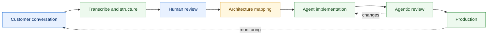
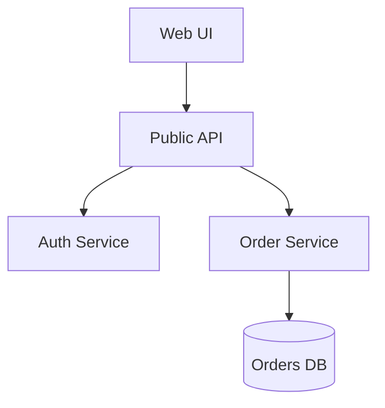
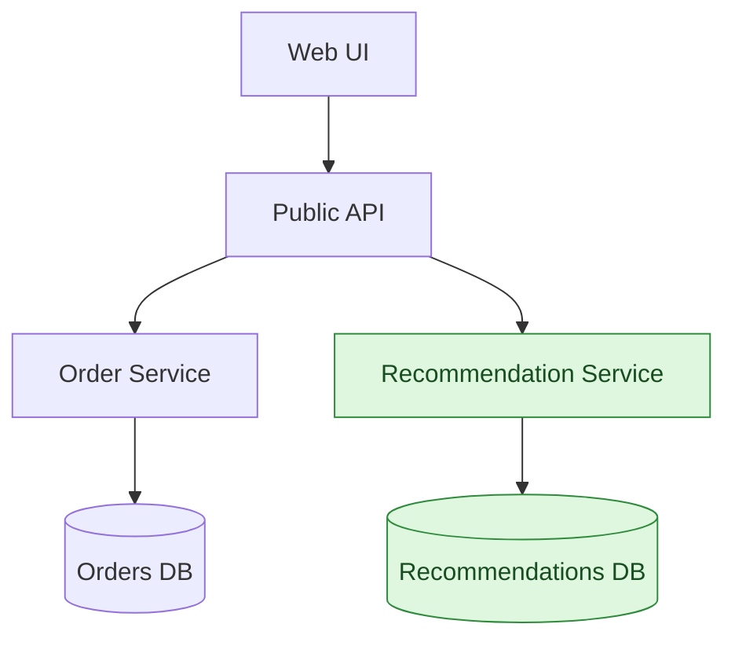
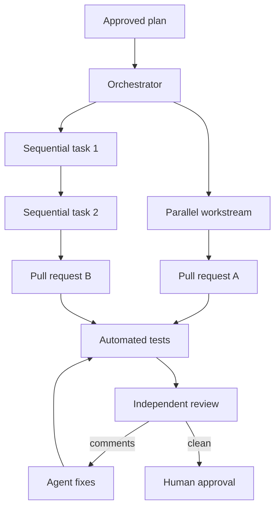
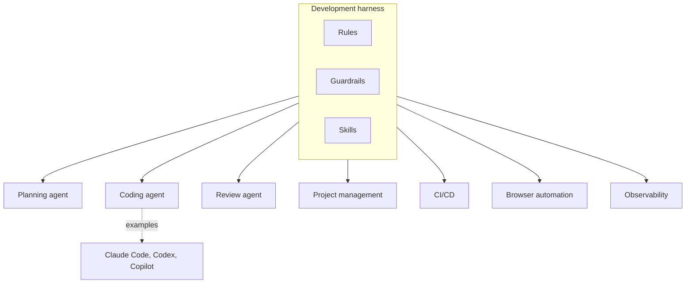
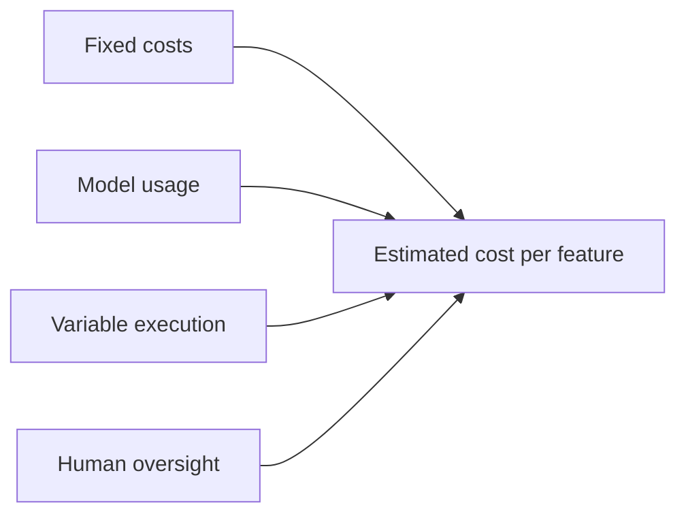

Before the lifecycle.

```mermaid
flowchart LR
    accTitle: Human-governed AI software development lifecycle
    accDescr: Twelve stages move from customer conversation to production with human review and feedback loops.
    C[Customer conversation]:::human --> T[Transcribe and structure]:::ai
    T --> H[Human review]:::human
    H --> A[Architecture mapping]:::shared
    A --> I[Agent implementation]:::ai
    I --> R[Agentic review]:::ai
    R --> P[Production]:::ai
    R -. changes .-> I
    P -. monitoring .-> C
    classDef human fill:#e8f1ff,stroke:#1769d2,color:#0b326d;
    classDef ai fill:#edf9ee,stroke:#2e8b3c,color:#174d20;
    classDef shared fill:#fff7df,stroke:#d48b00,color:#6f4700;
```

Between diagrams.

```mermaid
flowchart TD
    accTitle: Baseline service architecture
    accDescr: The web interface calls a public API connected to authentication, ordering, and the orders database.
    UI[Web UI] --> API[Public API]
    API --> AUTH[Auth Service]
    API --> ORDER[Order Service]
    ORDER --> ODB[(Orders DB)]
```

```mermaid
flowchart TD
    accTitle: Proposed recommendation-service architecture
    accDescr: The baseline architecture adds a highlighted recommendation service and recommendations database.
    UI[Web UI] --> API[Public API]
    API --> ORDER[Order Service]
    ORDER --> ODB[(Orders DB)]
    API --> REC[Recommendation Service]
    REC --> RDB[(Recommendations DB)]
    class REC,RDB proposed;
    classDef proposed fill:#dff6df,stroke:#2e8b3c,color:#174d20;
```

```mermaid
flowchart TD
    accTitle: Agent orchestration and pull-request workflow
    accDescr: An orchestrator creates parallel and sequential pull requests that enter a test and review feedback loop.
    PLAN[Approved plan] --> ORCH[Orchestrator]
    ORCH --> PA[Parallel workstream]
    ORCH --> S1[Sequential task 1]
    S1 --> S2[Sequential task 2]
    PA --> PRA[Pull request A]
    S2 --> PRS[Pull request B]
    PRA --> TEST[Automated tests]
    PRS --> TEST
    TEST --> REVIEW[Independent review]
    REVIEW -->|comments| FIX[Agent fixes]
    FIX --> TEST
    REVIEW -->|clean| HUMAN[Human approval]
```

```mermaid
flowchart TB
    accTitle: Development harness integrations
    accDescr: A shared harness governs agents, delivery platforms, browser automation, and observability integrations.
    subgraph H[Development harness]
        RULES[Rules]
        GUARDS[Guardrails]
        SKILLS[Skills]
    end
    H --> PLAN[Planning agent]
    H --> CODE[Coding agent]
    H --> REVIEW[Review agent]
    H --> PM[Project management]
    H --> CI[CI/CD]
    H --> UI[Browser automation]
    H --> OBS[Observability]
    CODE -. examples .-> CE[Claude Code, Codex, Copilot]
```

```mermaid
flowchart LR
    accTitle: Feature cost model
    accDescr: Fixed, model, variable, and human oversight costs combine into the estimated cost per feature.
    FIXED[Fixed costs] --> TOTAL[Estimated cost per feature]
    MODEL[Model usage] --> TOTAL
    VARIABLE[Variable execution] --> TOTAL
    HUMAN[Human oversight] --> TOTAL
```

After the lifecycle.
